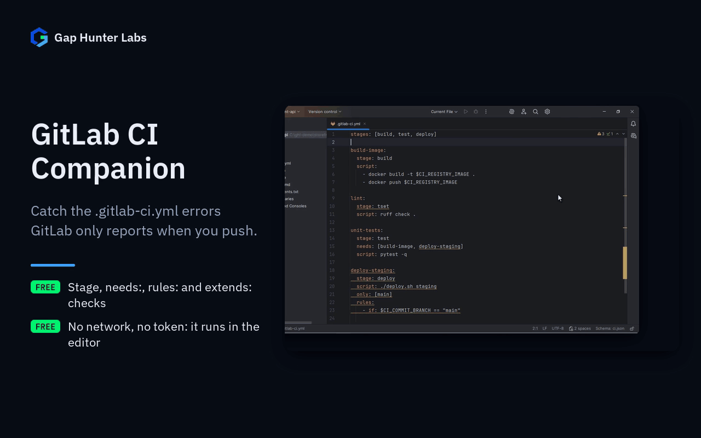

# GitLab CI Companion

IntelliJ-family plugin. Static syntax and structural checks for
`.gitlab-ci.yml` — catch mistakes before running a real pipeline, not
after.



Each feature on its own:
[Stage typos](docs/media/01-stage-check.gif) ·
[needs: across stages](docs/media/02-needs-order.gif) ·
[only: with rules:](docs/media/03-only-rules.gif)

## Why it exists

Born from real evidence in JetBrains Marketplace reviews of "GitLab
CICD — Pipelines & Jobs, Builds Run Cancel Retry View Log" (26,891
downloads, paid), not assumptions:

- `org.gitlab4j.api.GitLabApiException: Field 'kind' doesn't exist on
  type 'CiJob', Field 'downstreamPipeline' doesn't exist on type
  'CiJob'...` — the plugin breaks against newer self-hosted GitLab
  instances after API schema changes, reported repeatedly across
  different GitLab versions (14.6.1, 14.10.5).
- "each time I need to add PAT to this plugin. And when I'm adding the
  PAT for the second gitlab, then the first becomes useless" — no
  per-project/multi-instance credential scoping.

## Why built this way

- **Zero network calls by default; live pipeline status is opt-in.**
  Both complaints above trace back to the same root cause: depending
  on a live GitLab API surface that can drift out from under the
  plugin (schema changes) or needs credential management the plugin
  gets wrong (multi-instance PATs). Every static check still runs
  purely against the `.gitlab-ci.yml` text open in the editor, with no
  network call, exactly as in v0.1 — that promise never changes.
  Configure a GitLab instance + Personal Access Token in Settings and
  a "GitLab CI" tool window (bottom) shows real pipelines/jobs for the
  project's detected remote. The pipeline/job parser reads only the
  fields it actually displays and ignores anything unknown or missing
  — confirmed necessary, not just tidy, against a real response
  captured from `gitlab.com/api/v4` (a job object carries full nested
  user/commit objects) — the direct fix for the schema-drift
  `GitLabApiException` complaint above. Tokens are stored one per
  GitLab instance via the IDE's own credential store, never a shared
  field — the direct fix for the "adding a second PAT breaks the
  first" complaint. Design history in `future/v0.2-pipeline-status/README.md`.
- **v1 scope cuts, deliberate:** only GitLab instances at the root of
  their domain (`https://host/api/v4/...`) — self-hosted installs
  mounted under a subpath aren't supported yet. No job log viewer;
  double-clicking a pipeline opens it in the browser instead.
- **Filename/path-based detection, never content-sniffed.** Detects
  `.gitlab-ci.yml` and any `.yml`/`.yaml` under a `.gitlab/` directory —
  no `FileTypeOverrider`, no risk of the FileType-desync class of bug
  documented in this workspace's `ansible-companion/KNOWN_ISSUES.md`
  (Round 3).
- **Every check is a real, verifiable structural fact**, computed from
  the bundled YAML plugin's own PSI — a `stage:` that isn't one of the
  pipeline's stages (`.pre`, the declared `stages:` or GitLab's default
  `build`/`test`/`deploy`, `.post`; GitLab's own "chosen stage does not
  exist" error), jobs missing `script:`/`trigger:`/`extends:`, `rules:` entries using
  a key GitLab doesn't recognize, `only:`/`except:` combined with
  `rules:` (GitLab rejects that job -- "may not be used with `rules`";
  earlier versions of this README wrongly said GitLab silently ignores
  `only`/`except`), and duplicate job names. A hidden job (name starting
  with `.`) is exempt from the script/trigger/extends check — GitLab
  never runs it on its own, it exists purely as an `extends:` template.
- **Pipeline-graph errors GitLab only reports when you push**, with the
  wording of GitLab's own source (`lib/gitlab/ci/yaml_processor.rb`,
  `lib/gitlab/ci/config/extendable/entry.rb`): a `needs:` or
  `dependencies:` entry on a job in a *later* stage ("need X is not
  defined in current or prior stages"), a need listed twice, a circular
  `extends:`, and an `extends:` chain deeper than GitLab's limit of 10.
  Neither JetBrains's own GitLab CI inspections (IntelliJ IDEA Ultimate)
  nor CI Aid for GitLab check these; they check that a needed job
  *exists*, not where it runs. Fail-closed on purpose: a job's stage is
  followed through `extends:` templates in the same file (the last
  template wins, as GitLab merges them), and anything that comes from an
  `include:` -- a template, or the stage list itself -- is never guessed
  at; needs on another pipeline/project, on a hidden job, or with
  `parallel:matrix` are skipped too.
- **CI/CD inputs.** A file with a `spec:` header is checked on the
  pipeline after the header's `---`, the document GitLab actually runs;
  a value GitLab fills in from `$[[ inputs.* ]]` (or reads through a YAML
  alias) is left alone rather than guessed.
- **Included files.** Only the project's own top-level `.gitlab-ci.yml`
  is judged on stages and on a missing `script:`. A file under `.gitlab/`,
  or a `.gitlab-ci.yml` further down the tree, is usually pulled in by an
  `include:`, and its stage list -- often the rest of a job too -- lives
  in the file that includes it; the checks that only look inside one job
  (rules, `only`/`except`, duplicated needs, `extends:` cycles) still run.
- **Measured on real pipelines.** Every check was run over 250 public
  `.gitlab-ci.yml` files; each warning was reviewed by hand, and every
  false positive found there was fixed and turned into a test.
- **Every rule independently toggleable**, same discipline as API
  Security Companion's settings — no rule is ever mandatory.

## Usage

Open any `.gitlab-ci.yml` (or a `.yml`/`.yaml` under `.gitlab/`) — checks
run automatically as part of the editor's normal highlighting pass.
Disable individual checks under Settings > Tools > GitLab CI Companion.

For live pipeline status: Settings > Tools > GitLab CI Companion > add
a GitLab instance URL + a Personal Access Token (`api`/`read_api`
scope), then open the "GitLab CI" tool window (bottom) — it detects
the project's GitLab remote automatically from `.git/config`.

## Support

- **Bugs and feature requests:** [GitHub Issues](https://github.com/GapHunterLabs/gitlab-ci-companion/issues)
- **Questions, or custom rules for a team's codebase:** **gaphunterlabs@gmail.com**
- **Security vulnerabilities:** report privately as described in [SECURITY.md](SECURITY.md), not in a public issue.
- **Privacy and network behavior:** [PRIVACY.md](PRIVACY.md)

## Development

```
./gradlew test           # unit tests
./gradlew buildPlugin    # generates build/distributions/*.zip
./gradlew verifyPlugin   # checks compatibility against real IDEs
```

## License

Apache-2.0. See `LICENSE`.
